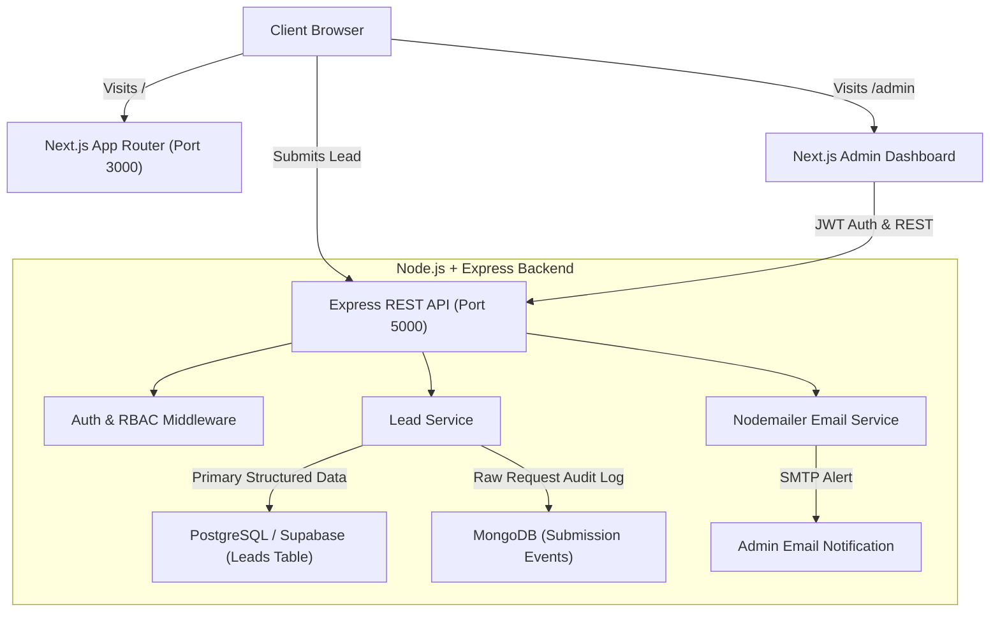

# ApexGrowth — Full-Stack Lead Generation & Pipeline Engine

A production-grade, full-stack Lead Generation web application and CRM ingestion pipeline built with **Next.js 14 (App Router)**, **Material UI (MUI)**, **Node.js/Express**, **Supabase (PostgreSQL)**, **MongoDB (Audit Telemetry)**, **JWT Authentication with RBAC**, and **Nodemailer**.

---

## 🌟 Architecture & Key Features



### 1. Frontend (Next.js 14 + Material UI)
- **App Router & SSR**: Fully typed TypeScript architecture with `@emotion/cache` integration in `ThemeRegistry.tsx` to eliminate style flashes and SSR hydration discrepancies.
- **Custom MUI Design System**: Fully customized ThemeProvider (vibrant royal blue palette, custom typography, 12px rounded cards, elevated shadows, component overrides) avoiding default styles.
- **Landing Page Experience**:
  - **Hero Section**: Engaging headline, value proposition, KPI metrics cards, and CTA triggers.
  - **Capabilities/Services**: Semantic cards detailing inbound acquisition, account-based sequences, automated qualification, and CRM sync.
  - **Testimonials**: Enterprise social proof with 5-star ratings, quotes, company badges, and avatars.
  - **Lead Capture Form**: Responsive form with fields (`name`, `email`, `phone`, `message`), client-side validation, loading spinners, and alerts.
  - **Semantic SEO**: Open Graph tags, Twitter cards, meta descriptions, `sitemap.xml`, and `robots.txt` with crawler instructions.

### 2. Backend (Node.js + Express REST API)
- **Decoupled Architecture**: Independent Express API service communicating via clean JSON REST endpoints.
- **JWT Authentication & RBAC**:
  - Issues short-lived Access Tokens (`15m`) and long-lived Refresh Tokens (`7d`).
  - Two distinct roles:
    - **`admin`**: Full access to inspect leads and permanently delete records.
    - **`viewer`**: Read-only access to browse incoming leads without delete privileges.
  - Password hashing via `bcryptjs`.
- **Nodemailer Notifications**:
  - Sends high-priority HTML email notifications to the admin on every lead submission.
  - Supports standard SMTP (Gmail App Passwords, Resend, Sendgrid) with automatic Ethereal test mailbox fallback in local dev.

### 3. Polyglot Persistence: Why PostgreSQL + MongoDB?
In `backend/src/models/AuditLog.ts`, the database layer implements polyglot persistence:
1. **PostgreSQL (via Supabase)**: Acts as the **System of Record (SoR)** for structured business leads (`id`, `name`, `email`, `phone`, `message`, `source`, `created_at`). It guarantees ACID transactions, relational indexing, and clean data governance.
2. **MongoDB (Audit Telemetry Collection)**: Acts as an **immutable, append-only Event Store**. It captures raw HTTP request payloads, client IP, User-Agent, referer headers, and validation outcomes. Decoupling this prevents schema migrations when front-end tracking tags change and protects the primary SQL database from write contention during high-volume campaigns.

---

## 📁 Repository Structure

```text
WebApp/
├── docker-compose.yml              # Local container orchestration (Backend + MongoDB)
├── .gitignore                      # Monorepo git ignore rules
├── README.md                       # Complete documentation & setup instructions
│
├── backend/                        # Node.js + Express API
│   ├── Dockerfile                  # Multi-stage production container build
│   ├── .dockerignore
│   ├── .env.example                # Backend environment template
│   ├── package.json
│   ├── tsconfig.json
│   └── src/
│       ├── config/
│       │   └── db.ts               # Supabase PostgreSQL client & MongoDB connection
│       ├── controllers/
│       │   ├── authController.ts   # Login, Refresh token, Profile controller
│       │   └── leadController.ts   # Lead submission, listing, deletion
│       ├── middleware/
│       │   └── auth.ts             # JWT validation and RBAC guards
│       ├── models/
│       │   ├── AuditLog.ts         # MongoDB Schema with architectural comments
│       │   └── User.ts             # User repository with pre-seeded demo accounts
│       ├── routes/
│       │   ├── authRoutes.ts       # /api/auth endpoints
│       │   └── leadRoutes.ts       # /api/leads endpoints
│       ├── services/
│       │   ├── emailService.ts     # Nodemailer transporter & HTML email generator
│       │   └── leadService.ts      # Coordination across Postgres, Mongo, and Email
│       └── server.ts               # Express application entrypoint
│
└── frontend/                       # Next.js 14 (App Router) + MUI
    ├── package.json
    ├── tsconfig.json
    ├── next.config.js
    ├── .env.example
    └── src/
        ├── app/
        │   ├── layout.tsx          # Root layout with SEO, OpenGraph & ThemeRegistry
        │   ├── page.tsx            # Landing page layout
        │   ├── globals.css         # Global CSS resets & smooth scroll
        │   ├── robots.ts           # Dynamic robots.txt
        │   ├── sitemap.ts          # Dynamic sitemap.xml
        │   └── admin/
        │       ├── login/page.tsx  # Admin Login UI with quick role fill buttons
        │       └── page.tsx        # Protected Admin Dashboard with MUI Data Table
        ├── components/
        │   ├── Navbar.tsx          # Responsive navbar with drawer & admin link
        │   ├── Hero.tsx            # Semantic H1, conversion copy & metric cards
        │   ├── Services.tsx        # Semantic H2 & 4 core service cards
        │   ├── Testimonials.tsx    # Semantic H2 & social proof testimonials
        │   ├── LeadForm.tsx        # Lead capture form with live validation
        │   └── Footer.tsx          # Semantic footer
        ├── context/
        │   └── AuthContext.tsx     # Admin authentication state provider
        ├── lib/
        │   └── api.ts              # Frontend API client
        └── theme/
            ├── theme.ts            # Custom Material UI theme definition
            └── ThemeRegistry.tsx   # Emotion cache provider for Next.js App Router
```

---

## 🚀 Quickstart Guide

### Prerequisites
- **Node.js**: v18.0.0 or higher (v20+ recommended)
- **npm**: v9+
- *(Optional)* **Docker & Docker Compose** for containerized running

---

### Step 1: Clone and Configure Environment Files

1. **Backend Environment**:
   ```bash
   cd backend
   cp .env.example .env
   ```
   *(By default, `.env` includes safe dev fallbacks so the backend runs immediately without live keys).*

2. **Frontend Environment**:
   ```bash
   cd ../frontend
   cp .env.example .env.local
   ```

---

### Step 2: Set up Supabase PostgreSQL (Optional for Production)

If connecting to your live Supabase project:
1. Open your Supabase SQL Editor and execute:
   ```sql
   CREATE TABLE IF NOT EXISTS leads (
     id UUID PRIMARY KEY DEFAULT gen_random_uuid(),
     name VARCHAR(255) NOT NULL,
     email VARCHAR(255) NOT NULL,
     phone VARCHAR(50),
     message TEXT NOT NULL,
     source VARCHAR(100) DEFAULT 'landing_page',
     created_at TIMESTAMPTZ DEFAULT NOW()
   );
   ```
2. Paste your project URL and service role key into `backend/.env`:
   ```env
   SUPABASE_URL=https://your-project.supabase.co
   SUPABASE_SERVICE_ROLE_KEY=your-supabase-service-role-key
   ```
*(Note: If left unconfigured, the backend automatically uses an internal memory repository for instant local testing!)*

---

### Step 3: Run the Application Locally

#### Terminal 1 — Start Backend:
```bash
cd backend
npm install
npm run dev
```
Backend API will start at **http://localhost:5000**.
- API Info: http://localhost:5000/api
- Healthcheck: http://localhost:5000/health

#### Terminal 2 — Start Frontend:
```bash
cd frontend
npm install
npm run dev
```
Frontend application will be live at **http://localhost:3000**.

---

### Step 4: Run with Docker Compose

To spin up the Backend API together with a local MongoDB instance in Docker:
```bash
docker compose up --build
```
This starts:
- **Backend API**: http://localhost:5000
- **MongoDB**: localhost:27017

---

## 🔐 Authentication & Demo Accounts

Pre-seeded accounts are configured to evaluate Role-Based Access Control:

| Role | Email | Password | Permissions |
| :--- | :--- | :--- | :--- |
| **Admin** | `admin@example.com` | `AdminPass123!` | View leads table, search/filter, **delete leads** |
| **Viewer** | `viewer@example.com` | `ViewerPass123!` | View leads table, search/filter (**delete disabled**) |

You can test this by visiting **http://localhost:3000/admin/login** and clicking either **"Fill Admin"** or **"Fill Viewer"**.

---

## 📡 API Endpoint Reference

### Public Endpoints
- `POST /api/leads` — Submit a new inquiry from the landing page.
  ```json
  {
    "name": "Alex Johnson",
    "email": "alex@enterprise.com",
    "phone": "+1 555-019-2834",
    "message": "Interested in evaluating pipeline acceleration services.",
    "source": "landing_page_hero"
  }
  ```

### Authentication Endpoints
- `POST /api/auth/login` — Authenticate and receive `accessToken` + `refreshToken`.
- `POST /api/auth/refresh` — Exchange `refreshToken` for a fresh `accessToken`.
- `GET /api/auth/me` — Retrieve profile of authenticated user (`Bearer <token>` required).

### Protected Lead Management Endpoints
- `GET /api/leads` — Retrieve leads list (`Bearer <token>` required, `admin` or `viewer` role).
- `DELETE /api/leads/:id` — Delete a lead (`Bearer <token>` required, **`admin` role only**; `viewer` receives `403 Forbidden`).

---

## 🧪 Testing & Verification

1. **Submit a Lead**: Go to http://localhost:3000/#contact, fill out the form, and submit.
2. **Review Alert**: The backend triggers Nodemailer (check terminal logs for Ethereal preview link or live delivery).
3. **Audit Log**: The raw telemetry event is logged to MongoDB.
4. **Viewer Check**: Login as `viewer@example.com` at http://localhost:3000/admin/login. View the newly created lead in the table and verify the Delete button is disabled.
5. **Admin Check**: Logout, log in as `admin@example.com`. Verify the Delete button is active, click to delete, and confirm removal.
